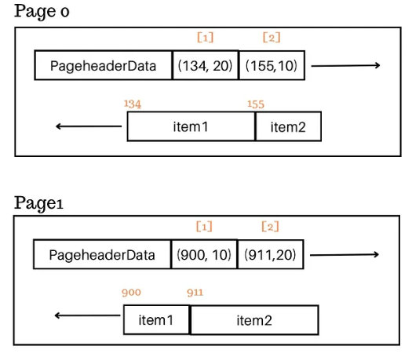

# A Deep Dive in How Slow SELECT \* is

- in a row-store database engine, rows are stored in units called pages
- each page has a fixed header and contains multiple rows, with each row having a record header followed by its respective columns
- PostgreSQL example: 
  

- NOTE: on the picture, row tuples represent `(row start offset, no of bytes)`
- table's one file organized as an array of fixed-size pages. When we read from disk, we say which bytes to `read()` (in Linux up to 2 GB) and where to start. Pages have fixed-size (Postgres 8K, InnoDB MySQL 16K) which means we can easily find the right page.
- FS blocks are mapped to SSD blocks/sectors on drive; those blocks are physically read (we read blocks, not bytes). When we read, we read the minimum number of blocks, the system allows us to read (4K in most cases)
- when those blocks are read, we have them in memory as bytes
- when database fetches a page, it places it in the shared buffer pool (caches those pages in case someone queries some data which live in that page), we gain access to all rows and columns present within that
  page
- full table scan means read pages one by one until we find the record we need
- ok, so if all columns/rows are already available, then why is `SELECT *` so costly

## Index-only scans are not used

- using `SELECT *` means that the database optimizer cannot choose index-only scans
- example:
  - we need IDs of students who scored above 90
  - we have an index on the grades column containing student ID as well as a non-key
  - this index is a perfect candidate for this query
  - still, if we use `SELECT *`, the database needs to access the heap data page to get the remaining fields increasing random reads resulting in far more I/Os. IDs are in index, but it has to grab other fields (by ID primary keys)
  - in contrast, the database could have only scanned the grades index and returned the IDs if you didn't use `SELECT *` (ID is in leaf nodes of B-tree)
- NOTE: in Postgres, even if we wanted just the student ID, it would have to go to table to ask for ID, because tuple pairs are stored in index showing the page no/offset where the record is stored. All indexes in PG are secondary.
  - if we have a covering index contains values of the record itself in index, then we do not need to make an extra call to table

## Deserialization cost

- deserialization (decoding) - process of converting bytes (coming from file, network communication...) into data types - more structured format, such as objects or variables in programming languages
- when you perform a `SELECT *` query, the database needs to deserialize all columns, even those you may not need for your specific use case
- this can increase the computation overhead and slow down query

## Not all columns are inline

- a significant issue with `SELECT *` queries is that not all columns are inline - not all columns are stored inline within the page
- large columns, such as texts or blobs, may be stored in external and only retrieved when requested (Postgres TOAST tables are example). Inline means all columns of the same page are consecutive, then comes the next row with all its columns etc.
- these columns are often compressed, so when you perform a `SELECT *` query with many text fields, geometry data, or blobs, you place an additional load on the database to fetch values from external tables, decompress them (CPU work), and return the results to clients

- pages are fixed size, but rows cannot span multiple pages - databases do not allow that
  - those are assigned a pointer (unique identifier) and it points to an external table

## Network cost

- before the query result is sent to the client, it has to be serialized according to the communication protocol supported by the database. That serialization takes its CPU work toll, so more data, more CPU work.
- after the serialization happened, we have data bytes which are transmitted through TCP/IP. The more TCP segments you need to send, the higher the transmission cost is - means more network latency
- returning all columns (potentially large string or blob columns) affects the deserialization as described above
- side note: Google increased the number of max segments per transmission to 10 (10 \* MTU = 10 \* 1500 = 15000)

## Client deserialization

- once the client receives the raw bytes, the client app must deserialize the data to whatever language the client uses, adding to the overall processing time. The more data, the more time it needs, thus the slower process it is.

## Unpredictability

- let's say you have a table with one or two fields and your app fires `SELECT *`. Everything works fine with such data structure.
- at some point, another JSON, XLM column, blob and other columns populated and used by other apps. Suddenly the whole app slowes down because it now picks up some extra fields that your app didn't need to begin with.

## Code grep

- With explicit columns projected in queries, we can easily search the code (for usage of particular columns needed/used) and we can remove or alter those that are not needed/has to be changed.
