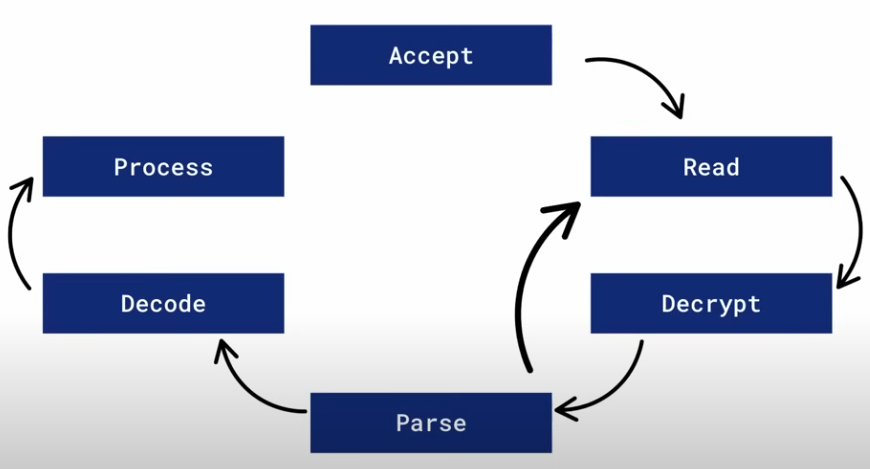

# Anatomy of a Request: Beyond Backend Processing

- a message that has a start and an end defined by a protocol
- HTTP defines things like boundaries of byte chunks that are sent via TCP stream
- both sides in a communication need to understand that protocol (it's like a speaking the same language)
  -> HTTP, SSH, PG, DNS
- when you send an HTTP request, it does not have to be a single packet, it can be packed into multiple packets

### HTTP request zoomed in

- lets' say it is an HTTPS request

1. Do the connection - a medium trusted by both sides and that medium is used to transmit data
   -> connection handshake - it's purpose is to make sure that bytes are received in the same order that they are sent on; SYN, SYN/ACK, ACK
2. TLS - TLS handshake -> the idea is to exchange symmetric keys (actually exchange secrets in order to create symmetric keys)
3. an actual HTTP request POST / <headers> <body>

### User vs kernel space

- TCP handshake lives in the kernel
- client app and server app reside in user space
- client connection: connection socket lives in kernel space
  - it gets assigned a file descriptor (number)
- server connection listener: e.g. \*:443 lives in kernel space (also gets a file descriptor)
- after the connection has been created (the handshake has been done), kernel leaves that connection in its accept queue (lives in kernel); to complete the connection creation the backend app has to make a system call - `accept(file_descriptor_no)` - the file descriptor no argument has to match a listener socket descriptor
- when this accept call is made, an actual connection descriptor is made (in kernel space again) used to write response data
- before sending data it needs to be encrypted
- the symmetric key is negotiated in TLS handshake - using the exchanged TLS symmetric key, client encrypts the request in chunks

`encrypt()`

```
POST /
<headers>
<headers>
<body>
<body>
<END>
```

- when encrypting, you actually have to copy data to a buffer where it is encrypted, it is not encrypted in place (in case it gets corrupted, we cannot go back); copy uses CPU to transfer data to CPU registers, so it consumes some CPU for copying and encrypting
- the data is still in the user space (virtual memory of a process); to write it, we have to write it to kernel
- client calls write against the connection file descriptor, kernel buffers writes (send buffer) (copying to kernel space also takes some CPU time, again copying) and flushes them to the network (Niegel algorithm, it is very expensive to write one by one); MTU (maximum transmission unit) is the limit up to which it buffers it -> one TCP segment
- Backend's side receives the encrypted chunks in `receive buffer`; the backend app calls `read()` on the connection file to copy it - from kernel space to user space
- the backend has to decrypt these chunks now using the exchanged TLS key (again copying takes some CPU)
- now we come to parsing the request; using `content-legth` header backend protocol finds the end of the request

```
POST /
<headers>
<headers>
<body>
<body>
<END>
```

- it is possible that we only read a part of the request, so we have to encrypt/decrypt more...
- backend has to decode body - body can be UTF8, JSON, protobuf, etc. Decoding converts raw bytes into usable objects. This costs CPU again. Also, decompress is needed.
- headers are not compressed - because of an attack called CRIME (sniff and detect the packet content) - HTTP/1.1
- when decoded and decompressed, we can process the request
- the backend finally produces the response, encrypts it and writes it to the connection socket which gets delivered to the client
- NOTE: as a user you never write to the network, you write to the kernel and then kernel writes to the network
  

1. Accept
2. Read
3. Decrypt
4. Parse (we can again go to cycle 2,3, 4 depending on the size of the sent request)
5. Decode (optionally)
6. Process

## Considerations

- Accept - how fast the backend can accept connections
  - backend that doesn't accept fast enough will have large backlogs (will queue them in an accept queue - source ip and source port)
  - multiple threads, socket sharding, `SO_REUSEPORT` - multiple processes listening to the same port and each one of them will have its own queue; kernel will distribute requests to these queues
  - kernel setting optimizations
- Read - how fast the backend can read data?
  - backend that doesn't call read fast enough accumulate receive buffers
  - fills up the receive buffers, slows down flow control window
  - goes through CPU
- Decrypt - what ciphers are being used?

  - TLS is done in userspace
  - Pure CPU cost
  - HAProxy evaluating SSL libraries (aws-lc!)

- Parse - extracting request metadata
  - HTTP/1.1 is simpler to parse than HTTP/2 or HTTP/3
  - that is why HTTP1 consumes less CPU than HTTP/2 and HTTP/3
- Decode - what is the body content
  - decompressing (if content-encoding is set)
  - decoding JSON can get expensive especially large ones
  - pure CPU
- Process - actually process the request
  - let the main thread execute the request
  - delegate to a thread or process

## Some configurations

- **net.ipv4.tcp_mem** - controls the receiver buffer size (128 kbytes by default)
- **net.ipv4.tcp_wmem** - controls the send buffer size
- **net.ipv4.somaxconn** - maximum pending connections in the accept queue

- What if we have a CDN, Load balancer, API gateway and then our backend, this encrypt and decrypt happens over and over between these hops

- TCP is a stream-based, a bunch of bytes, no boundaries, guarantees the order, control flow and delivery
- UDP is a message-based protocol, does not guarantee delivery
