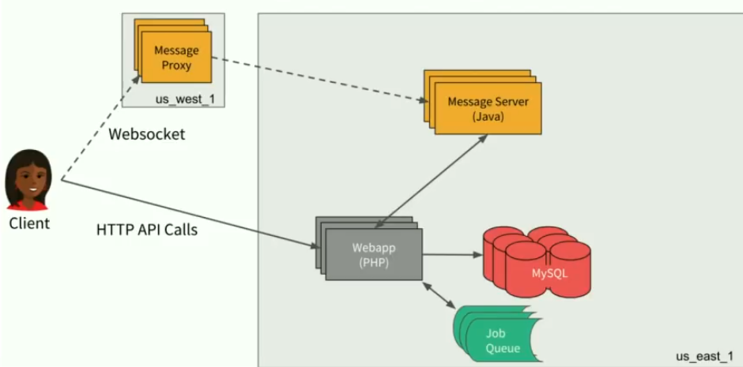
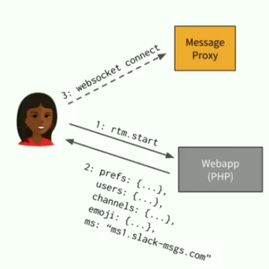
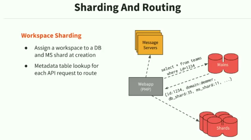
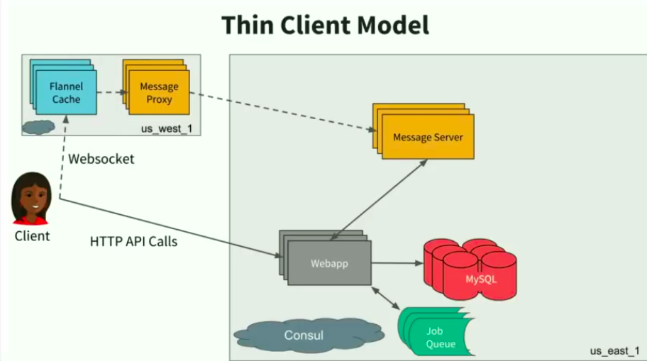
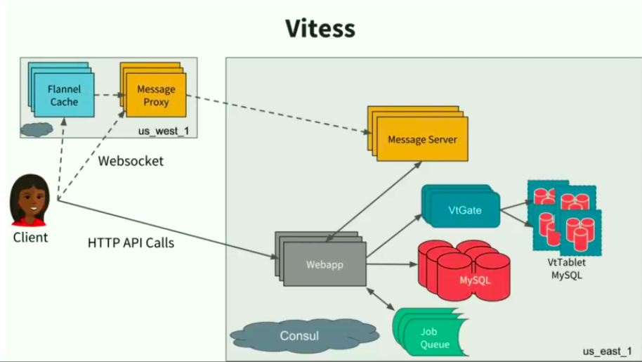
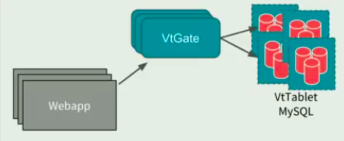
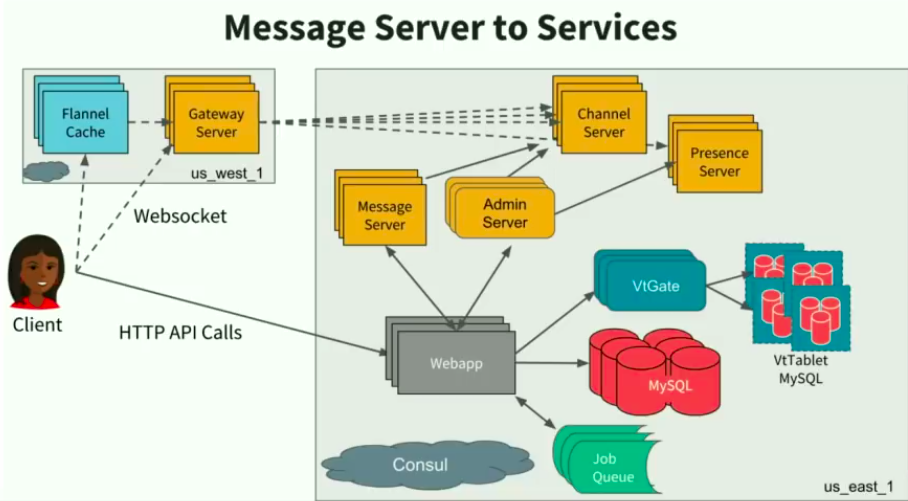
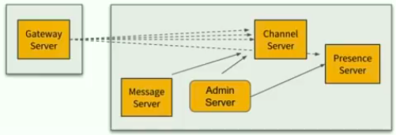

# Scaling Slack - The Good, the Unexpected, and the Road Ahead

## Slack at 2016

- 4M daily active users
- 2.5M peak simultaneous connected avg 10hrs/day
- largest org > 10000 active users
- they had two active masters of their main database - deployed in pair to maintain the failover, they synced asynchronously - availability over consistency

## Slack at 2018

- 8M+ daily active users
- \>7M peak simultaneous connected avg 10hrs/day
- \> 125 000 active users
- at boot, they load in user profile data (settings, preferences etc)

Challenge #1: Boot model explosion:

- `boot payload size = num_users * user_profile_in_bytes + num_channels * (channel_info_size + num_users_in_channel * user_id_in_bytes)`
- For 100,000 users, payload size was about 100 MB
- Solution: thin model client -> flanel cache - edge caching service distributed all across the globe
- on boot, the client makes a websocket connection to flannel cache + message proxy
- Flannel cache had a worksapce affinity (do not load data for all workspaces, but rather for those who will use that instance)
- Flannel efficiency - efficently responds to >1+ million queries/s; the challenge is cache coherence

Challenge #2: shard hot spots & manual repair; huge organizations

- Vitess - fine-grained DB sharding (invented at YouTube)
  - flexible sharding - manages per-table sharding policy (it merges results from multiple shards if query demands that)
  - topology management - database servers self-register
  - single-master - using GTID and semi-sync replication
  - failover - orchestrator promotes a replica on failover
  - resharding workflows - automatically expands the cluster
    
    
- Migrating to a channel-sharded/user-sharded data model helps mitigate hot spots for large teams and thundering herds
  - retains MySQL at the core for developer/operations continuity
  - more mature topology management and cluster expansion systems
  - data migrations that change the sharding model take a long time

Challenge #3: shared channels

- initial design: one message server handles all data and pub-sub around one workspace (all channels, metadata, etc.)
- decomposition by channel, not by workspace
- what if one channel belongs to multiple workspaces
  
- Message server to services:

  - gateway server: websocket termination and subscriptions
  - channel server: pub/sub fanout with 5 minute bufferring
  - presence server: stores and distributes presence state
  - admin server: cluster management and routing
  - (legacy) message server: used for reminders, scheduled messages, Google Calendar integration
    

- Generic messaging services:

  - everything is a pub/sub channel, including message channels as well as workspace/user metadata channels
    - clients/flannel subscribes to updates for all relevant objects
    - each message service has dedicated clear roles and responsibilities
    - self-healing cluster orchestration to maintain availability
    - each user session now depends on many more servers being available

- Herd of Pets to Service Mesh
  - For each of these projects (and more), architecture evolved from hand-configured server hostnames to discovery mesh
    - Enables self-registration and automatic cluster repair
    - adds reliance on service discovery infrastructure (consul)
    - led to changes in service ownership and on-call rotation
- Scatter may be harmful

  - migrating from a workspace-scoped to channel or user scoped spreads out the load, but adds a requirement to sometimes scatter/gather
    - removes artificial couplings on back end systems
    - teams are less isolated, so need extra protections from noisy neighbors
    - when scattering, clients should tolerate partial results and retry
    - tail latencies can dominate performance when fetching from many

- Deploying is only the beginning

  - as hard as it is to add new services into production under load, it's proven as hard if not harder is to remove old ones

- At 2018, they had a plan to:
  - storage POPs - geographically distributed back end
  - services services services - decompose the monolith and improve service mesh
  - job queue - revamp the asynchronous task queue
  - resiliency - degraded functionality when subsystems are unavailable
  - eventual consistency - change API expectations
  - network scale - stay ahead of the growth curve
