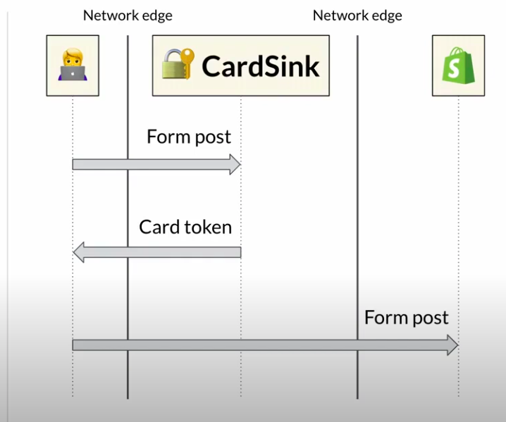

# Shopify’s Architecture to Handle the World’s Biggest Flash Sales

- flash sale - mass sells of products in a short period of time
- Tech stack:

  - Rails + MySQL + Redis + memcached; Go and Lua at some performance critical places
  - React (Native) + GraphQL
  - 40 deploys per day
  - working fully remote

- Three use-cases:

1. store front

- ready heavy
- availability
- cacheable

2. checkout

- write heavy
- consistency
- external services

3. admin

- R/W mix
- consistency

- Shopify pod - contains data for one to many shops, a mini shopify self-contained
- multiple pods per region, sharing the stateless workers (web worker, job worker); if something goes wrong with one pod, other pods in the same region are not affected
- one region has a failover replica, so if something is wrong with one region, the other region can take over

- Shopify offers custom domains to its merchants
- once someone hits an API on a subdomain it lands on OpenResty - a Nginx distribution that supports Lua scripting -> used to route traffic to the right pod and blocks bots
  - it has a Lua module called `sorting hat` - it hosts the routing table and routes the traffic based on it (maps `shop_id` to `pod_id`)
- the request is forwarded to a region where the pod is active
- Rails application receives it and handles it
- Rails application is a monolith

  - many modules: Merchandise, Pricing, Checkout, Payments, Shipping, Taxes, Inventory...

- Credit card payments
  - must obey to PCI - Payment Card Industry data security standard
  - they offer custom UI to their users (meaning a store can adjust its look by adding some HTML and JS), plus they can add some apps to enhance the functionality of their stores
  - they serve credit card payment forms in a separate iframe hosted on a different domain from the merchant store and their checkout  

  

1. When someone fills in the card details (card numbers, CVV, expiry date etc)
2. that request goes to Card Sink, it encrypts the card details and returns a token
3. checkout JS then sends it (along other details) it to the main Shopify application
4. It actually goes (token + payment details) to CardServer
5. CardServer based on token gets the card details from CardSink
6. CardServer then authorizes card - that goes to Processor
7. CardServer returns a sucess response

- FlashSales numbers for Black Friday and Cyber Monday 🤯:

  - 6.3B USD - USD total sales
  - 3.1M sales per minute (peak)
  - 32M requests per minute (peak)
  - 11M MySQL queries per minute (peak)
  - 24B - background jobs performed
  - 42B - API calls made to partner apps

- Tenant isolation principle - each shop shouldn't know about any other shop

  - every unit of work (request or background job) should operate on a single shop at a time

- If a shop becomes too resource demanding, there might be a need to rebalance shops to pods

1. First we migrate all MySQL data to another pod - e.g. migrate all data with `shop_id = 1`
2. new MySQL data is replicated by reading the MySQL binlog - a stream of events for every row that is modified
3. after this is complete, we lock the shop for all writes, they are queued
4. we then start copying over jobs and other things in Redis
5. we then update the pod id for that particular shop in routing table
6. we remove the write lock
7. the old data from old pod is deleted asynchronously

- This process takes less than 10 seconds of downtime, for larger stores, less than 20 seconds
- Storefront is a ready heavy component and it was rewritten completely from scratch as an isolated component
- they also offer to their clients to create their own frontend (SPA usually)

- they conduct the load testing in production
- they have a tool called Genghis - their load generator

  - it spins a lot of VMs that execute Lua scripts. These Lua scripts describe the certain behavior that they see -> they do not want to hit the storefront with million GET requests because that will only tell them how good the caching works. Instead they execute end-to-end flows, like browsing, adding to cart, checking out etc. They support both logged in and anonymous users behavior.
  - they run a load testing against benchmark stores that they have in production. Every pod has at least one.
  - they do not use the real payment processors (cards), they have a benchmark gateway written in Go used to respond with a realistic distribution of successful/failed answers with realistic latencies.
  - **They run these tests at least weekly**
  - all of these components have the expectactions set in Service DB. If there are not meet, code owners are notified and expected to prioritize a fix.

- they also use circuit breakers
  - when a circuit is open, they tend to make it first half-open after the certain of time to prove that it is functional now by allowing some smaller number of requests going through
  - if those requests do not pass, then it leaves it open for a little while
  - they have a lib called toxiproxy (implemented in Go) that allows them to inject different failures (circuit breaker usecase is one of them) and test these in their UTs
- They handle the idempotency well ->
  - if you have 3 steps and 2 of them passed, one failed
  - if you rerun the same request, they will load in the recovery steps for that request - to handle first these 2 successful steps and then try making the third step passes
- they prepare architecture testing/scale testing in advance and practically prepare for BFCM throughout the year

- they have customers which have the entire pod for themselves
- read replicas are used to send data to warehouse

- Pets and Cattles:

1. Pets

The "Pets" service model describes carefully tended servers that are lovingly nurtured and given names like they were faithful family pets. Zeus, Apollo, Athena et al are well cared for.

When they start to fail or struggle, you carefully nurse them back to health, scale them up and make them shiny and new once in a while.

Being a mainframe, solitary service, database server or load balancer, when Zeus goes missing, everybody notices.

2. Cattle

Cattle on the other hand aren't afforded quite the same loving attention as Zeus or Apollo. This service model typically tags servers like svr01 svr02 svr03 etc much the same way cattle ear tags are applied. They are all configured pretty much identically, so that when one gets sick, you simply replace it with another one without a second thought.

A typical use of cattle configurations would be web server arrays, search clusters, no-sql clusters, datastores and big-data clusters.

As the adoption of bare-metal racked cattle servers either on-prem or in data centers became popular, so did the need for automation to control them. Tools like Puppet and Chef enabled Ops to configure fleets of "cattle" using automation.

- Shopify pods are cattles
- Shopify is probably the biggest user and contributor of/to Ruby and RoR
